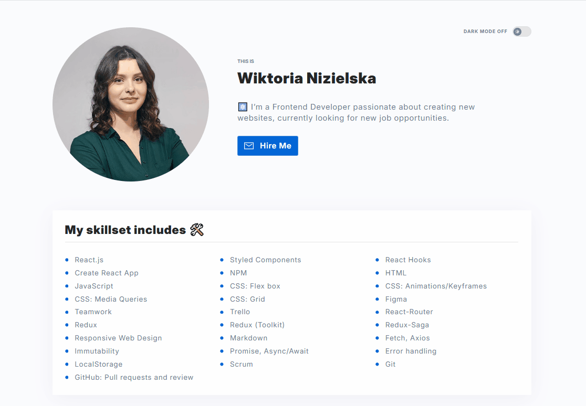

# Personal Homepage

## Description
Welcome to my virtual CV! Personal homepage is an interactive web application built with React. It showcases my skills and projects. 

Demo: https://wiktorianizielska.github.io/personal-homepage/

## Features
- 👋 **Get to know me:** Section about me contains profile photo and description
- 🛠️ **Skills:** List of my current skills
- 🚀 **Goals:** List of technologies I'm going to learn next
- 📂 **Portfolio:** My projects fetched from gitHub API
- 📧 **Contact:** Section with social media links and email
- 🖥️📱💻**Responsive design:** that works across all devices
- 🌓**Theme switch:** you can choose light or dark mode

## Technologies

     
  -%20%20?style=flat&logo=JAVASCRIPT&logoColor=black&color=%23F0DB4F)     

- **React**
- **Redux**: React-Redux, Redux Toolkit  (createSlice, store, useSelector, useDispatch)
- **Redux-Saga**: side effects handling
- **Styled-components**: theme, ThemeProvider, GlobalStyle
- **SVG** images as React components
- **Create React App**
- **npm**
- **Webpack**
- **Babel**
- **HTML**
- **CSS**: Media Queries, normalize.css, transition, Flex, Grid, alternative box model, keyframes animations
- **JavaScript**: JS modules, arrays, objects, ternary operator, arrow functions, immutabililty
- **JS Async**: asynchronous functions, async/await
- **Axios**
- Fetching from GitHub API
- error handling: **try/catch**
- **Figma**: The app was created based on design project in figma

## Available Scripts

In the project directory, you can run:

### `npm start`

Runs the app in the development mode.\
Open [http://localhost:3000](http://localhost:3000) to view it in your browser.

The page will reload when you make changes.\
You may also see any lint errors in the console.

### `npm run build`

Builds the app for production to the `build` folder.\
It correctly bundles React in production mode and optimizes the build for the best performance.

The build is minified and the filenames include the hashes.\
Your app is ready to be deployed!

See the section about [deployment](https://facebook.github.io/create-react-app/docs/deployment) for more information.

### `npm run eject`

**Note: this is a one-way operation. Once you `eject`, you can't go back!**

If you aren't satisfied with the build tool and configuration choices, you can `eject` at any time. This command will remove the single build dependency from your project.

Instead, it will copy all the configuration files and the transitive dependencies (webpack, Babel, ESLint, etc) right into your project so you have full control over them. All of the commands except `eject` will still work, but they will point to the copied scripts so you can tweak them. At this point you're on your own.

You don't have to ever use `eject`. The curated feature set is suitable for small and middle deployments, and you shouldn't feel obligated to use this feature. However we understand that this tool wouldn't be useful if you couldn't customize it when you are ready for it.

